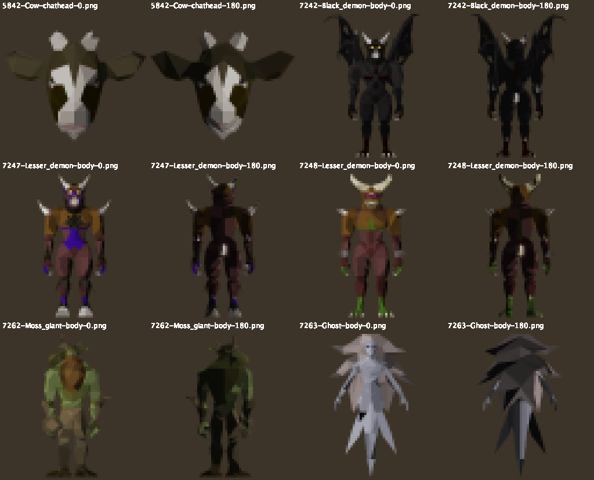
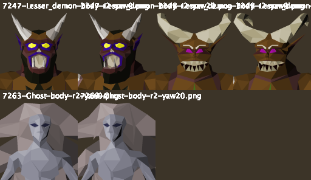

# Portrait spike (plan Task 10) — 2026-10-10

**Outcome: it works.** A flat software render of the NPC's own models gives a recognisable, correctly coloured
portrait, client-only, from public API. The "Show portrait" setting can go ahead, with a plan of its own (see
"For the plan" below).

## What was tried

- **(a) Off-screen model widget: not built.** A widget draws onto the game canvas, so getting it out as an image
  means reading the frame buffer after a frame is drawn. That's onscreen, depends on timing, and isn't needed,
  because (b) works.
- **(b) Software render: works.** On branch `spike/portrait` (throwaway, not merged).
  `PortraitSpikeProbe` takes `getChatheadModels()` (or `getModels()` when there's no chathead), then
  `Client.loadModelData`, `mergeModels`, the composition's `recolor` pairs and `light()`, and hands the lit
  `Model`'s arrays to `PortraitSpike.render`. That is a pure painter's-algorithm rasteriser: orthographic,
  supersampled 4x, the client's 16-bit HSL turned into RGB, and textured faces drawn grey at their light level.
  Run it with `./gradlew run -PportraitSpike`.

## Measured (operator session, 2026-10-10, 00:08–00:18)

From `./gradlew run` stdout; 10 renders, 0 failures, 0 "not loaded":

```
    id=5842 name=Cow src=chathead parts=1 faces=386 load+light=530us render=8093us
    id=5842 name=Cow src=chathead parts=1 faces=386 load+light=515us render=6803us
    id=7262 name=Moss giant src=body parts=3 faces=1254 load+light=3389us render=6990us
    id=7263 name=Ghost src=body parts=1 faces=545 load+light=975us render=4556us
    id=7248 name=Lesser demon src=body parts=5 faces=1814 load+light=4882us render=11174us
    id=7247 name=Lesser demon src=body parts=5 faces=1660 load+light=2707us render=13513us
    id=7248 name=Lesser demon src=body parts=5 faces=1814 load+light=5181us render=12117us
    id=7247 name=Lesser demon src=body parts=5 faces=1660 load+light=3180us render=8307us
    id=7242 name=Black demon src=body parts=5 faces=2298 load+light=5280us render=7970us
    id=7247 name=Lesser demon src=body parts=5 faces=1660 load+light=2430us render=8101us
```

- **Cost:** load and light take 0.5–5.3 ms, and rendering a 64px image takes 4.6–13.5 ms. All of it runs **on the
  client thread** in the spike, once per change of target.
- **Coverage:** only the Cow had chathead models. The other 5 ids (Moss giant, Ghost, two Lesser demon ids, Black
  demon) fell back to body models and rendered full-body.
- **Picture:** `portrait-sheet.png` shows every dump, scaled 4x, with yaw 0 and yaw 180 side by side. At yaw 0 every
  model shows its front, with its own colours and recolours (both Lesser demon variants differ correctly). No
  textures went visibly wrong.



## Caveats, measured or not

- **Mirroring `[assumed]`:** painter's order and yaw are both uncertain in sign, and two wrong signs give the front
  view mirrored. Every model tested is roughly symmetric, so the dumps can't tell the two apart. A model with a
  one-sided weapon would settle it.
- **No in-game screenshot** of the overlay was taken. The PNGs are the exact images the overlay drew.
- **Two Lesser demon ids alternating** (7247/7248) re-rendered each time, because the spike caches only the last id.

## For the plan (Task 10 step 3)

1. **Thread:** copy the arrays on the client thread (≤5.3 ms measured), and render off it. Cache images per
   composition id (LRU), so alternating targets cost nothing.
2. **Size and placement:** a full-body model in a row as tall as one line of text is tiny. Decide whether to crop to
   the top of the model (a "head" crop for body models), and how it sits in the Compact and Full layouts.
3. **Setting:** "Show portrait", default Off (spec), as already decided.
4. **Settle the mirroring** `[assumed]` with an asymmetric model before shipping.

## Round 2 — head crop, inside the panel (2026-10-10, 00:29–00:33)

Commit `5330050`. Body models are cropped to a square over their top 30%. Chatheads are drawn whole. The portrait is
drawn inside the panel, left of the name, as tall as the content. Yaw 0 and yaw 20 are rendered at 128px and drawn
side by side for comparison.

```
    id=7247 name=Lesser demon src=body parts=5 faces=1660 load+light=2832us render x2=45444us
    id=7263 name=Ghost src=body parts=1 faces=545 load+light=16888us render x2=52296us
    id=7248 name=Lesser demon src=body parts=5 faces=1814 load+light=5733us render x2=32915us
    id=7247 name=Lesser demon src=body parts=5 faces=1660 load+light=2686us render x2=37872us
    id=7247 name=Lesser demon src=body parts=5 faces=1660 load+light=5923us render x2=23733us
```

- **The crop works.** Both Lesser demon variants are told apart at a glance by their horns, colours and faces, and the
  Ghost's face reads (`portrait-sheet-r2.png`, and the operator's screenshots at 00:29:45, 00:30:05, 00:30:27). The
  portrait sits flush in the panel, on its background, with no frame.
- **0 vs 20 degrees hardly differ** at panel size. In the screenshots the two squares are near-identical.
- **Cost rose:** two 128px renders took **23.7–52.3 ms** on the client thread, and one cold load and light took
  16.9 ms (Ghost). That's one to three frames dropped on each new target. A shipped version **must render off the
  client thread**, once, at the size it is drawn.
- **Not seen:** every screenshot is the Stacked layout (Detail: Compact). There is no screenshot of a single-line
  layout, so "panel height in every layout" isn't checked there.


